# 📚 - Tutorial de Desenvolvimento Web com Django

> 👨‍💻 # Este repositório abriga um abrangente tutorial sobre o desenvolvimento web usando o framework Django. Aprenda passo a passo a criar um aplicativo web, desde a configuração inicial até o deploy em um ambiente de produção.

## 📜 Sumário
- [Fase 1: Configuração Inicial e Ambiente de Desenvolvimento](#-fase-1-configuração-inicial-e-ambiente-de-desenvolvimento)
- - [1.1. Instalação do Python e Pip.](#11-instalação-do-python-e-pip)
- - [1.2. Configuração de um ambiente virtual (Virtual Environment).](#12-configuração-de-um-ambiente-virtual-virtual-environment)
- - [1.3. Instalação do Django usando o Pip.](#13-instalação-do-django-usando-o-pip)
- - [1.4. Inicialização de um novo projeto Django.](#14-inicialização-de-um-novo-projeto-django)
- - [1.5. Inicialização de um novo app Django.](#15-inicialização-de-um-novo-app-django)
- - [1.6. Executando o servidor com Runserver](#16-executando-o-servidor-com-runserver)
- [Fase 2: Estrutura de Diretórios e Primeiras Configurações](#-fase-2-estrutura-de-diretórios-e-primeiras-configurações)
- - [2.1. Estrutura de Diretórios do Projeto](#21-estrutura-de-diretórios-do-projeto)
- - [2.2. Configuração do Banco de Dados](#22-configuração-do-banco-de-dados)
- - [2.3. Configuração do Banco de Dados no MySQL Workbench](#23-configuração-do-banco-de-dados-no-mysql-workbench)
- - [2.4. Configuração do Banco de Dados no Django](#24-configuração-do-banco-de-dados-no-django)
- - [2.5. Instalação de Pacotes Python para MySQL no Django](#25-instalação-de-pacotes-python-para-mysql-no-django)
- [Fase 3: Models e Banco de Dados](#-fase-3-models-e-banco-de-dados)
- - [3.1. Criar Modelos](#31-criar-modelos)
- - [3.2. Migrações e Aplicação](#32-migrações-e-aplicação)
- - [3.3. Django Admin](#33-django-admin)
- - [3.4. Criar Superusuário](#34-criar-superusuário)
- [Fase 4: Views e URLs](#-fase-4-views-e-urls)
- - [4.1. Criar Views](#41-criar-views)
- - [4.2. Definir URLs](#42-definir-urls)
- - [4.3. Configurando URLs de Setup](#43-configurando-urls-de-setup)
- - [4.4. Criar um Template](#44-criar-um-template)
- [Fase 5: Templates e Páginas HTML (static, partials, layout, media)](#-fase-5-templates-e-páginas-html-static-partials-layout-media)
- - [5.1. Criar Templates HTML](#51-criar-templates-html)
- - [5.2. Configurando Arquivos Estáticos](#52-configurando-arquivos-estáticos)
- - [5.3. Arquivos Estáticos (CSS, JS, Imagens)](#53-arquivos-estáticos-css-js-imagens)
- - [5.4. Uso de Modelos Parciais (Partial Templates):](#54-uso-de-modelos-parciais-partial-templates)
- - [5.5. Templates e Layouts:](#55-templates-e-layouts)
- - [5.6. Configurando Arquivos de Mídia e Imagens do Banco:](#56-configurando-arquivos-de-mídia-e-imagens-do-banco)
- [Fase 6: MVT (Model-View-Template) e Integração](#-fase-6-mvt-model-view-template-e-integração)
- - [6.1. Integrando Model, View e Template](#61-integrando-model-view-e-template)
- - [6.2. Compreendendo a Integração](#62-compreendendo-a-integração)
- - [6.3. Divisão das responsabilidades MVT](#63-divisão-das-responsabilidades-mvt)
- [Fase 7: Administração do Django](#-fase-7-administração-do-django)
- [Fase 8: Formulários e Validação](#-fase-8-formulários-e-validação)
- - [8.1. Criando um Formulário](#81-criando-um-formulário)
- - [8.2. Renderizando o Formulário em uma View](#82-renderizando-o-formulário-em-uma-view)
- - [8.3. Criando um Template para o Formulário](#83-criando-um-template-para-o-formulário)
- - [8.4. Personalizando Formulário Template](#84-personalizando-formulário-template)
- - [8.5. Mapear URLs](#85-mapear-urls)
- [Fase 9: Autenticação e Autorização](#-fase-9-autenticação-e-autorização) EM BREVE
- [Fase 10: CRUD (Create, Read, Update, Delete)]() EM BREVE
- [Fase 11: Testes e Depuração]() EM BREVE
- [Fase 12: Deploy (Implantação) em Produção]() EM BREVE

---------------------------------------------------------------

## 📗 Fase 1: Configuração Inicial e Ambiente de Desenvolvimento

### **1.1.** *Instalação do Python e Pip.*

- 🔔 Certifique-se de que o Python e Pip estejam instalados no seu sistema. Você pode verificar isso executando o seguinte comando no seu terminal ou prompt de comando:

```bash
python --version
```

```bash
pip --version
```

> Caso contrário, você pode baixa-los em seus sites e seguirem as instruções de instalação em [Python](https://www.python.org/downloads/) e [Pip](https://pip.pypa.io/en/stable/installation/)
>> Pip (Python Package Installer) geralmente é incluído na instalação do Python mais recente.

### **1.2.** *Configuração de um ambiente virtual (Virtual Environment).*

> 🗃️ # Um ambiente virtual é uma prática recomendada para isolar as dependências do seu projeto. Isso garante que você possa ter várias versões do Django e de outras bibliotecas em diferentes projetos sem conflitos.

##### 1. Abra um terminal ou prompt de comando

##### 2. Navegue até o diretório onde deseja criar seu ambiente virtual.

##### 3. Execute o seguinte comando para criar o ambiente virtual (substitua `nome-do-ambiente` pelo nome que você deseja para o seu ambiente):

- 🖥️ No Windows:
```bash
python -m venv nome-do-ambiente
```

- 💻 No macOS e Linux:
```bash
python3 -m venv nome-do-ambiente
```
##### 4. Para ativar o ambiente virtual, utilize os seguintes comandos no terminal ou prompt de comando:

- 🖥️ No Windows:
```bash
nome-do-ambiente\Scripts\activate
```

- 💻 No macOS e Linux:
```bash
source nome-do-ambiente/bin/activate
```

Agora, você está dentro do ambiente virtual e pode instalar as dependências específicas do projeto, incluindo o Django, quando ativar a venv seu terminal ficará assim:

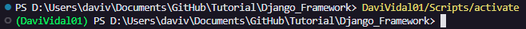

- 🔩 Lembrando que quando fechar o seu editor e abrir novamente, terá de ativar a venv (ambiente virtual) novamente seguindo a etapa [**1.2.4**](#4-para-ativar-o-ambiente-virtual-utilize-os-seguintes-comandos-no-terminal-ou-prompt-de-comando)

### **1.3.** *Instalação do Django usando o Pip.*

- 🔔 Dentro do ambiente virtual, você pode instalar o Django executando o seguinte comando no terminal ou prompt de comando:

```bash
pip install django
```

Isso instalará a versão mais recente do Django no seu ambiente virtual.

### **1.4.** *Inicialização de um novo projeto Django.*

- 🔔 Agora que o Django está instalado, você pode criar um novo projeto Django com o seguinte comando (substitua **nome-do-projeto** pelo nome que você deseja para o projeto):

- 📌 Recomendo que o nome seja **setup**, dessa forma fica mais fácil para diferenciar a pasta de setup onde serão guardadas as configurações do seu site, depois é só renomear o nome do projeto para **nome-do-projeto** que você desejar.

```bash
django-admin startproject nome-do-projeto
```

ou

```bash
django-admin startproject setup
```

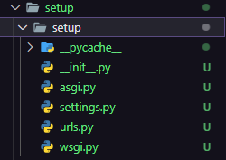

> 👨‍👦 # Assim criará a estrutura inicial do seu projeto Django, incluindo arquivos e diretórios necessários, pode renomear o diretório "pai" do projeto sem alterar o diretório **setup** que estiver dentro dele, normalmente os 2 possuem o mesmo nome, por isso que haverá complicações na hora de navegar.

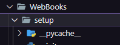

### **1.5.** *Inicialização de um novo app Django.*

- 🔔 Para criar um novo aplicativo dentro do projeto, execute o seguinte comando no terminal ou prompt de comando dentro do diretório (**nome-do-projeto**) onde é o seu projeto (substitua **nome-do-app** pelo nome do aplicativo):

```bash
cd nome-do-projeto
python manage.py startapp nome-do-app
```

Isso criará a estrutura de diretórios e arquivos para o seu novo aplicativo Django.

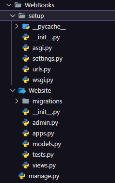

### **1.6.** *Executando o servidor com Runserver*
> 📌 # O servidor de desenvolvimento é uma ferramenta que permite que você teste e visualize seu aplicativo enquanto o desenvolve. Lembre-se de que o servidor de desenvolvimento é destinado apenas para uso durante o desenvolvimento e testes.

##### 1. Abra um terminal ou prompt de comando.

##### 2. Navegue até a pasta raiz do seu projeto Django, onde está localizado o arquivo `manage.py`. Use o comando `cd` para acessar a pasta (`WebBooks` é o nome da minha pasta Raiz/Pai do projeto). 
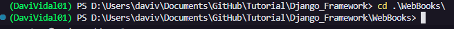

##### 3. Agora que você está na pasta do projeto e com o ambiente virtual ativado, você pode iniciar o servidor de desenvolvimento com o seguinte comando:

- 🖥️ No Windows:
```bash
python manage.py runserver
```

- 💻 No macOS e Linux:
```bash
python3 manage.py runserver
```
##### 4. Após executar o comando, o servidor de desenvolvimento começará a ser executado. Você verá mensagens no terminal indicando que o servidor está "exibindo" em um endereço, normalmente em http://127.0.0.1:8000/, é só clicar por cima e entrar no link e você conseguirá observar a página inicial do seu projeto:
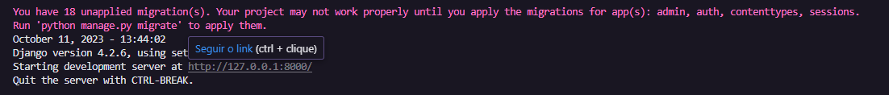
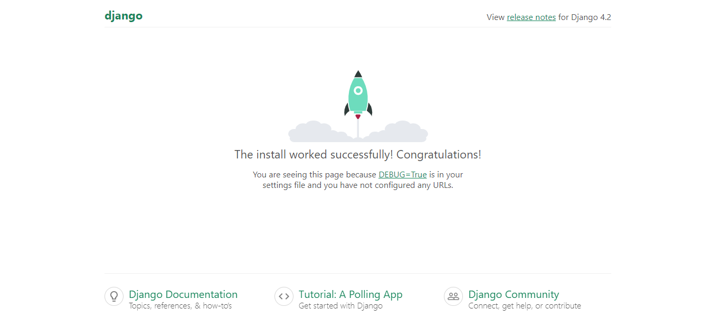

##### 5. Para desligar o Runserver, é só pressionar `Crtl + C` no terminal ou prompt de comando.

---------------------------------------------------------------

## 📗 Fase 2: Estrutura de Diretórios e Primeiras Configurações

### **2.1.** *Estrutura de Diretórios do Projeto*

> 🗂️ # Um projeto Django possui uma estrutura de diretórios organizada. Vamos dar uma olhada nos diretórios e arquivos principais, usaremos os meus exemplos como referência:

- `WebBooks/`: Este é o diretório raiz do seu projeto, no seu caso será o **nome-do-projeto** que você escolheu, além de que pode ser possível renomea-lo sem problemas
- - `setup/`: O diretório interno com o mesmo nome contém as configurações do projeto, caso renomea-lo terá de reconfigurar todos os arquivos internos dele.
- - - `settings.py`: Arquivo de configurações do projeto.
- - - `urls.py`: Arquivo de configurações de URLs.
- - - `wsgi.py`: Arquivo de configuração do servidor WSGI (usado para implantação em produção).
- - `Website/`: O diretório do seu aplicativo.
- - - `__init__.py`: Um arquivo Python vazio que informa ao Python que o diretório deve ser tratado como um pacote.
- - - `admin.py`:  Este arquivo é usado para configurar a administração do aplicativo, permitindo que você gerencie os modelos de dados por meio da interface de administração.
- - - `apps.py`: Arquivo de configuração do aplicativo, onde você pode definir metadados do aplicativo.
- - - `models.py`: Neste arquivo, você define os modelos de dados do aplicativo, que representam as tabelas do banco de dados.
- - - `tests.py`: Este é o local para escrever testes de unidade para o aplicativo.
- - - `views.py`: Neste arquivo, você define as visualizações que controlam a lógica de exibição do aplicativo.
- - - `migrations/`: Este diretório é criado quando você executa migrações e contém os arquivos de migração do aplicativo.
- - - `templates/`: Aqui, você pode criar diretórios e arquivos de modelos HTML usados para renderizar as páginas do aplicativo.
- - - `static/`: Diretório onde você pode armazenar arquivos estáticos, como folhas de estilo CSS, scripts JavaScript e imagens.
- - `manage.py`: Um utilitário de linha de comando para gerenciar seu projeto.

**🔩 - Algumas dessas estruturas iremos criar ao longo do tutorial**

### **2.2.** *Configuração do Banco de Dados*

>🔔 # Nesse tutorial iremos utilizar uma das formas de configurar o banco de dados, que é a utilização do XAMPP, Workbench MySQL e MySQL

##### 1. Instale o XAMPP, MySQL:

- Faça o download e instale o [XAMPP](https://www.apachefriends.org/pt_br/index.html)
- Faça o download e instale o [MySQLclient](https://dev.mysql.com/downloads/installer/) (Marque a opção MySQL Client na hora da instalação)
- Faça o download e instale o [MySQL Workbench](https://dev.mysql.com/downloads/workbench/) (É possível instalar o Workbench apenas com a instalação da etapa acima)

##### 2. Ligando o XAMPP (Apache e MySQL):

- Inicie o XAMPP Control Panel e certifique-se de que o servidor Apache e o servidor MySQL estejam em execução.

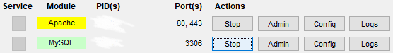

### **2.3.** *Configuração do Banco de Dados no MySQL Workbench*

- Abra o MySQL Workbench e clica no "+" para criar seu servidor.
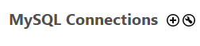

- Crie um novo servidor MySQL se ainda não tiver um configurado e coloque o nome da "**Connection Name**", se quiser pode colocar uma senha em "**Password**" e clica em "**Ok**"
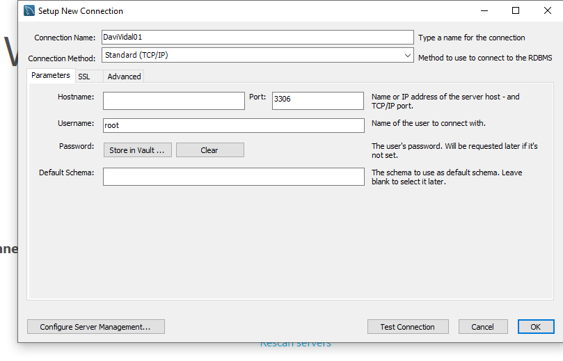

- Anote o nome do banco de dados, o nome de usuário (USERNAME) e a senha (PASSWORD) que você configurou no MySQL Workbench.

- Crie um novo esquema "**schema**" de banco de dados (database) para o seu projeto Django (por exemplo, **'WebBooksBD'**).
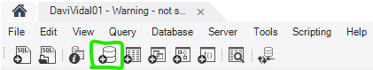

> É importante que o "**Charset/Collation**" sejam **utf8** e **utf8_unicode_ci** como na imagem, e depois dê **Apply**:
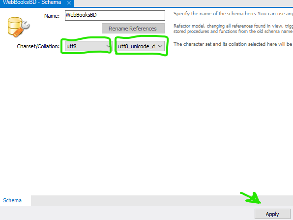

>> Depois de concordar tudo e finalizar as confirmações, seu banco será criado:
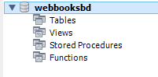

### **2.4.** *Configuração do Banco de Dados no Django*

- Abra o arquivo de configuração do banco de dados no seu projeto Django, que normalmente está localizado em `setup/settings.py`.

- Na seção **INSTALLED_APPS**, você vai inserir o nome do seu app entre os que já foram inseridos, colocando o **'nome-do-app',** dentro da seção como no exemplo:
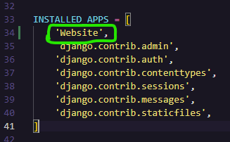

> Caso queira confirmar qual é o nome do seu app, é só entrar no seu app e no arquivo `apps.py`, lá você encontrará esse "**name**", é só copiar e colar.
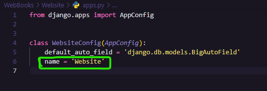

- Na seção **DATABASES**, você pode configurar a conexão com o MySQL Workbench. Substitua as configurações existentes pelas seguintes:

```bash
DATABASES = {
    'default': {
        'ENGINE': 'django.db.backends.mysql',
        'NAME': 'WebBooksBD',  # Nome do banco de dados que você criou no MySQL Workbench.
        'USER': 'seu_usuario_mysql',  # Nome de usuário do MySQL.
        'PASSWORD': 'sua_senha_mysql',  # Senha do MySQL.
        'HOST': 'localhost',  # Endereço do servidor do MySQL (normalmente 'localhost').
        'PORT': '3306',  # Porta do MySQL (normalmente '3306').
    }
}
```
> Certifique-se de substituir 'seu_usuario_mysql' e 'sua_senha_mysql' pelas credenciais reais do MySQL que você configurou no MySQL Workbench como as do meu:

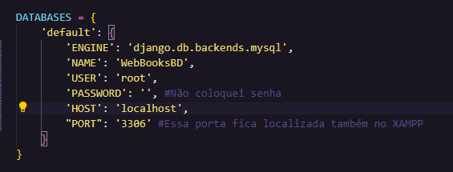

### **2.5.** *Instalação de Pacotes Python para MySQL no Django*
> 🌎 # Aqui iremos instalar os pacotes necessários para o funcionamento do Banco de Dados com Django, vamos instalar os pacotes necessários na Venv
>
> 🚀 # A não ser que você deseja baixar todos esses pacotes e recursos de forma global fora da Venv, você pode sair da venv toda vez que for iniciar o Runserver.
>> **Sair da Venv**: 
>> - Você pode estar fechando e abrindo o editor de codigo que você estiver utilizando, dessa forma a venv fechará também
>> - Caso dessa forma não dê certo, podemos utilizar esses comandos no terminal ou prompt de comando antes de fechar e abrir o editor.
>> 
>> 🖥️ No Windows:
>> ```bash
>> nome-do-ambiente\Scripts\deactivate
>> ```
>> 
>> 💻 No macOS e Linux:
>> ```bash
>> deactivate
>> ```
>
> **Pacotes Necessários**:
> - Para que o Django possa se comunicar com o banco de dados MySQL, você precisa instalar pacotes Python que oferecem suporte ao MySQL. Existem duas opções comuns: `mysql-connector-python` e `mysqlclient`.
>
> ```bash
> pip install mysql-connector-python
> ```
> ```bash
> pip install mysqlclient
> ```
>
> **Exemplo sem a Venv:**

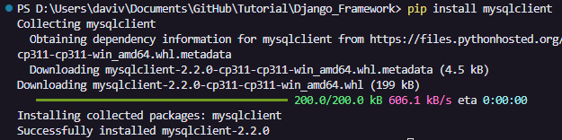

> 🛡️ - Depois ative novamente a Venv que você desativou usando os comandos que já foram ensinados para dar continuidade as configurações do seu projeto.

---------------------------------------------------------------

## 📗 Fase 3: Models e Banco de Dados

> 🔔 # Nesta fase, você criará modelos para representar dados em seu aplicativo Django e entenderá como o Django ORM (Object-Relational Mapping) funciona para mapear esses modelos para tabelas no banco de dados.

### **3.1.** *Criar Modelos*

- Modelos são classes que definem a estrutura dos dados que você deseja armazenar em seu banco de dados. Vamos criar um modelo simples como exemplo. Suponha que você esteja criando um aplicativo de gerenciamento de livros. Aqui está um exemplo de modelo de livro:

##### 1. Abra o arquivo `models.py` no diretório do seu aplicativo (por exemplo, `Website/models.py`).
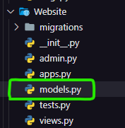

##### 2. Crie uma classe para o modelo de livro:
```bash
from django.db import models

class Livro(models.Model):
    titulo = models.CharField(max_length=200)
    autor = models.CharField(max_length=100)
    publicação = models.DateField()
    paginas = models.IntegerField()
```
> 🔔 - Neste exemplo, criamos um modelo de livro com campos como título, autor, data de publicação e número de páginas. Você pode personalizar os campos de acordo com suas necessidades.

### **3.2.** *Migrações e Aplicação*

- Agora que você criou o modelo, é hora de criar uma migração para aplicá-lo ao banco de dados.

##### 1. No terminal, dentro do diretório raiz/pai do projeto, execute o seguinte comando para criar uma migração:
```bash
python manage.py makemigrations
```
##### 2. Em seguida, execute o comando para aplicar a migração:
```bash
python manage.py migrate
```
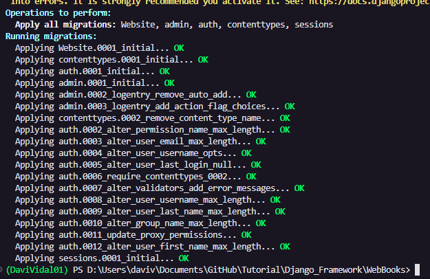

### **3.3.** *Django Admin*

- O Django oferece um painel de administração prontamente disponível para gerenciar os dados do banco de dados. Vamos habilitá-lo.

##### 1. Abra o arquivo `admin.py` no diretório do seu aplicativo (por exemplo, `Website/admin.py`).
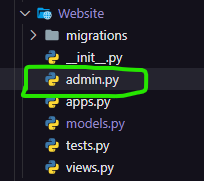

##### 2. Registre o modelo de livro no painel de administração:
```bash
from django.contrib import admin
from .models import Livro

admin.site.register(Livro)
```

> - **from .models import Livro:** Retira de dentro do arquivo `models.py` a class chamada `Livro`.
> - **admin.site.register(Livro):** Indica que no painel de Administrador do Django será possível registrar dados na tabela chamada `Livro`.

### **3.4.** *Criar Superusuário*

- Para acessar o painel de administração, você precisará criar um superusuário.

- No terminal, dentro do diretório do projeto, execute o seguinte comando e siga as instruções para criar um superusuário, e depois preencha os parâmetros com nome e senha que você não esquecerá, se preferir pode usar como no exemplo:

```bash
python manage.py createsuperuser
```

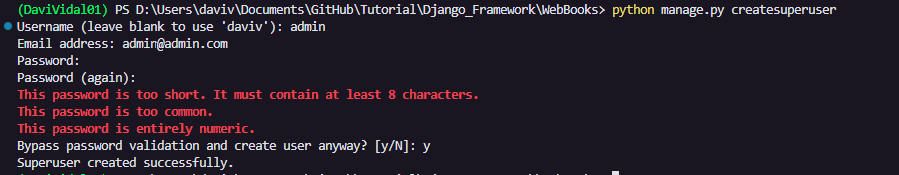

> 🔩 - O Password é invisível por questões de segurança, o Email pode ser aleatório ou o seu oficial, as informações colocadas no exemplo são:
> - Username: admin
> - Email: admin@admin.com
> - Password: 1234
> - Password (again): 1234
> - Confirmação se vou usar senha fraca: y

- Agora quando você fazer o comando do **Runserver** que já foi ensinado na etapa [**1.6.3**](#3-agora-que-você-está-na-pasta-do-projeto-e-com-o-ambiente-virtual-ativado-você-pode-iniciar-o-servidor-de-desenvolvimento-com-o-seguinte-comando), vá na URL do seu navegador e adiciona `/admin` e faça o login da sua conta que você criou aqui no Django.

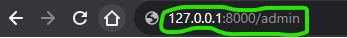

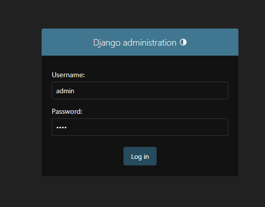

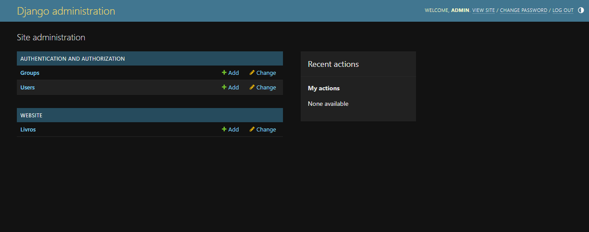

> 🎛️ # Nesse painel você consegue ter acesso para inserir informações, remover, editar e ler dados inseridos no seu banco de dados, esse ambiente não é recomendável que seja acessado por qualquer usuário, até mesmo para funcionários, é um ambiente de trabalho apenas do ADM do Banco de Dados ou usuários com privilégios elevados.
---------------------------------------------------------------

## 📗 Fase 4: Views e URLs

### **4.1.** *Criar Views*

- Views são funções ou classes que processam solicitações do navegador e retornam respostas. Vamos criar uma view simples que exibe uma lista de livros.

##### 1. Abra o arquivo `views.py` no diretório do seu aplicativo (por exemplo, `Website/views.py`).

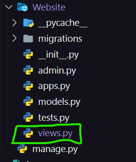

##### 2. Crie uma view:
```bash
from django.shortcuts import render
from .models import Livro

def lista_livros(request):
    livros = Livro.objects.all()
    return render(request, 'lista_livros.html', {'livros': livros})
```

> Nesta view, estamos obtendo todos os objetos de livro do banco de dados e passando-os para um template chamado *lista_livros.html*.
> - **livros = Livro.objects.all():** Pega todos os `objects` de models chamado `Livro` e passa-os para dentro da variável `livros`.
> - **render(request, 'lista_livros.html'):** Ele renderizará usando o `request`, o template (site) chamado `lista_livros.html` de dentro da pasta `templates` *(OBS: vamos criar a pasta ainda)*.
> - **{'livros' : livros}:** Ele criará um dicionário chamado `livros` e pegará a variável `livros` e receber todas as informações guardadas dentro da variável.

### **4.2.** *Definir URLs*

> 🔔 # As URLs mapeiam solicitações para views. Vamos definir uma URL que chama a view `lista_livros`.

##### 1. Crie um arquivo chamado `urls.py` no diretório do seu aplicativo (por exemplo, `Website/urls.py`).

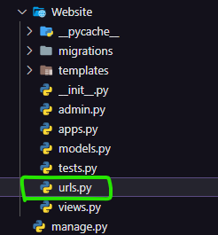

##### 2. Defina a URL dentro do arquivo `urls.py` no diretório do seu aplicativo:

```bash
from django.urls import path
from . import views

urlpatterns = [
    path('livros/', views.lista_livros, name='lista_livros'),
]
```

> Agora, quando os usuários acessarem `/livros/` em seu site, a view *lista_livros* será chamada.
> - **from . import views:** Importa da pasta atual (Website) tudo do arquivo views.py (Class, Funções, Métodos, etc.)
> - **path('livros/', views.lista_livros, name='lista_livros'):** Para acessar a `views.lista_livros` é necessário que o usuário esteja na página da URL `livros/`, o nome dessa path é nomeada de `lista_livros`
>>📌 *OBS:* A colocação de "," dentro do `urlpatterns` permite que possa ser criada várias `path` de uma vez, então é possível a criação de várias views e URLs para essas views em seu aplicativo.

### **4.3.** *Configurando URLs de Setup*

> 🔔 # Para que o setup do seu projeto reconheça que as configurações feitas nas URLs de dentro do seu aplicativo (Website) são oficiais, é necessário interligar uma ponte de acesso entre eles utilizando o `include`

- Navegue até o setup do seu diretório Raiz/Pai, procure pelo arquivo chamado `urls.py` e faça as devidas interligações:

```bash
from django.contrib import admin
from django.urls import path, include

urlpatterns = [
    path('admin/', admin.site.urls),
    path('', include('Website.urls'))

]
```
- Como no exemplo:

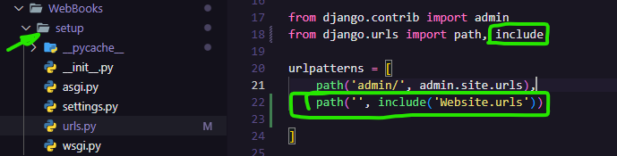

> - **path('', include('Website.urls')):** Ele faz um path dizendo que naturalmente todas as urls do aplicativo chamado `Website` localizados dentro do arquivo `urls` sejam acrescentadas/incluidas.

### **4.4.** *Criar um Template*

> 🔔 # Um template é um arquivo HTML que define como os dados são apresentados. Vamos criar um template para exibir a lista de livros.

##### 1. Crie uma pasta chamada `templates` no diretório do seu aplicativo (por exemplo, `Website/templates`).

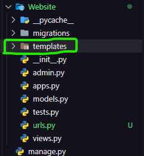

##### 2. Dentro da pasta templates, crie um arquivo chamado `lista_livros.html` (por exemplo, `Website/templates/lista_livros.html`)


##### 3. No arquivo `lista_livros.html`, você pode usar os dados passados pela view para criar a página da web:

```bash
<!DOCTYPE html>
<html>
    <head>
        <title>Lista de Livros</title>
    </head>
    <body>
        <h1>Lista de Livros</h1>
        <ul>
            
            <li>{{ livro.titulo }} por {{ livro.autor }}</li>
            
        </ul>
    </body>
</html>
```

> - **:** Aqui ele cria um "x" com o nome de `livro`, esse x vai passar por todos os itens que haver no "nome-representativo" chamado `livros` que interliga na views a variável chamada `livros` que você criou na etapa [**4.1.2**](#2-crie-uma-view)
>> 📌 *OBS:* Esse `{livros : livros}` que está na imagem de exemplo é igual a `{nome-representativo : variável}`, pois criamos um "nome-representativo" para referenciar no HTML a "variável" informada na views, que é a variável `livros = Livro.objects.all()`.

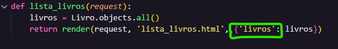

> - **{{ livro.titulo }}:** A lógica é parecida como as lógicas abordadas em programações da linguagem C, pegando um "x" que irá receber todos os valores de `titulo` 1 por vez e apresentarem todas 1 por vez no HTML. Isso é a mesma coisa com o `{{ livro.autor }}` também, é a mesma lógica de programação.
> - **:** O **FOR** só irá acabar quando TODOS os itens de cada campo informado dentro dele (por exemplo, `{{ livro.titulo }}`) forem apresentados.

##### 4. Testar a View

- Agora, você pode iniciar o servidor de desenvolvimento do Django e testar sua view, utilize runserver para testar o seu site como foi ensinado no [**1.6.3**](#3-agora-que-você-está-na-pasta-do-projeto-e-com-o-ambiente-virtual-ativado-você-pode-iniciar-o-servidor-de-desenvolvimento-com-o-seguinte-comando)

✔️ ▶ Lembre-se de ativar a sua Venv que foi ensinado no [**1.2.4**](#4-para-ativar-o-ambiente-virtual-utilize-os-seguintes-comandos-no-terminal-ou-prompt-de-comando)

🚫 ***ERROR - Caso você não ative:***

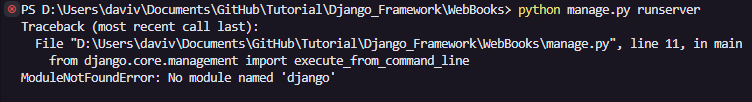

✔️ ▶ Lembre-se de deixar o seu Banco de Dados MySQL ligado (XAMPP) como foi ensinado no [**2.2.2**](#2-ligando-o-xampp-apache-e-mysql)

🚫 ***ERROR - Caso você não ligue:***

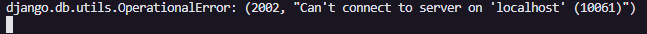

✔️ ▶ Lembre-se de digitar a URL corretamente como imagem mostrada no [**3.4**](#34-criar-superusuário)

🚫 ***ERROR - Caso você não digite:***


> 🗂️ - *OBS:* A página descreve quais URLs estão disponíveis

- Depois de tudo estiver em ordem, você poderá acessar a página com o Link que aparecerá quando você realizar o comando de Runserver.

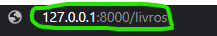

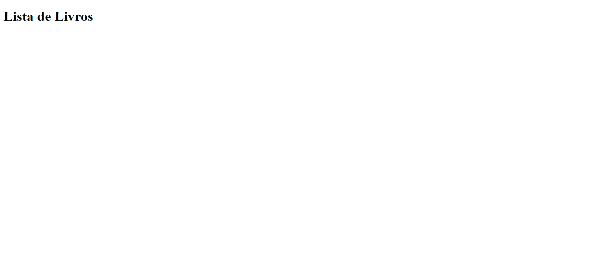

- Os livros não foram adicionados ainda pelo **FOR** no HTML, pois não há nenhum livro registrado no seu banco.

##### EXTRA. Tornar a página como principal (index), sem a necessidade de digitar `livros/` toda hora, para que ela possa aparecer sem essa necessidade.

> 🎛️ # Para tornar uma das páginas do seu app como principal (index), é necessário que você reconfigure a URL dessa página, é bem simples:

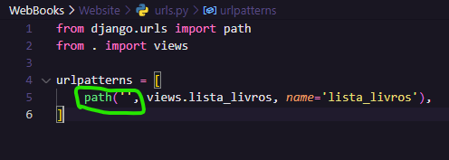

- Dessa forma o site assim que iniciar o servidor, irá te levar até a página diretamente sem a digitação na url.

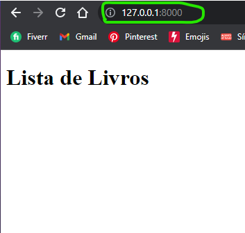

---------------------------------------------------------------

## 📗 Fase 5: Templates e Páginas HTML (static, partials, layout, media)

> 🔔 # Nesta fase, você aprenderá a criar templates para renderizar páginas HTML e tornar sua aplicação mais dinâmica. Além disso, veremos como lidar com arquivos estáticos, criar templates parciais e layouts, e como gerenciar arquivos de mídia.

### **5.1.** *Criar Templates HTML*

- Os templates HTML são usados para renderizar páginas da web com dados dinâmicos. Vamos criar um template simples para exibir detalhes de um livro.

##### 1. Crie um arquivo HTML chamado `livro_detalhes.html` em sua pasta de templates do aplicativo (por exemplo, `Website/templates/livros_detalhes.html`).

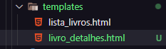

- Depois de criar o HTML (template), você terá de vincula-lo a uma View ou URLs, volte as etapas anteriores para rever como criar uma View e URL na [Fase 4: Views e URLs](#-fase-4-views-e-urls).

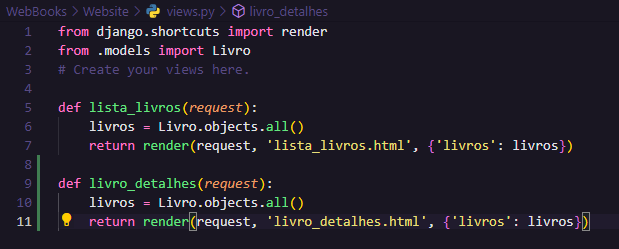


##### 2. Adicione o seguinte conteúdo ao `livro_detalhes.html` como exemplo:

```bash
<!DOCTYPE html>
<html>
    <head>
        <!--CSS-->
        <link rel="stylesheet" href="https://cdn.jsdelivr.net/npm/bootstrap@5.3.2/dist/css/bootstrap.min.css">
        <link rel="stylesheet" href="style.css">
        <!--Titulo-->
        <title>Detalhes do Livro</title>
    </head>
    <body class="bg-gray">
        <!--Header-->
        <header class="bg-gray d-flex justify-content-center py-3">
            <ul class="nav nav-pills">
              <li class="nav-item"><a href="../" class="nav-link" aria-current="page">Listar</a></li>
              <li class="nav-item"><a href="../detalhes" class="nav-link">Detalhes</a></li>
            </ul>
        </header>
        <!--Main-->
        <main class="bg-gray">
            
            
            <h1 class="border-bottom border-danger">{{ livro.titulo }}</h1>
            <p>Autor: {{ livro.autor }}</p>
            <p>Data de Publicação: {{ livro.publicação }}</p>
            <p>Número de Páginas: {{ livro.paginas }}</p>
            
        </main>
        <!--Footer-->
        <footer class="bg-gray d-flex flex-wrap justify-content-between align-items-center py-3 my-4 border-top">
            <div class="col-md-4 d-flex align-items-center">
              <a href="https://github.com/DaviVidal01">
                
              </a>
              <span class="mb-3 mb-md-0 text-body-secondary">© 2023 WebBooks, copyright.</span>
            </div>
        
            <ul class="nav col-md-4 justify-content-end list-unstyled d-flex">
              <li class="ms-3"><a class="text-body-secondary" href="https://github.com/DaviVidal01"></a></li>
              <li class="ms-3"><a href="https://github.com/DaviVidal01/"></a></li>
            </ul>
          </footer>
        <!--Scripts-->
        <script src="bootstrap.bundle.min.js"></script>
    </body>
</html>
```
> Aqui foi utilizado alguns recursos do framework [Bootstrap](https://getbootstrap.com/)
>>📌 - É bem grande mesmo, pois estamos simulando um site completo agora, se você observar, terá comentários (`<!--Comentários-->`) marcando a posição de cada parte do HTML, por exemplo (CSS, Scripts, Header, Main, Footer, etc.). Se estiver trabalhando em equipe ou sozinho, é uma ótima forma de organizar o seu código.

- Mas ainda há coisas faltando nesse template, colocamos exatamente as informações, mas o site ainda não aparece todas as informações que pedi, como CSS, JS ou Imagem.

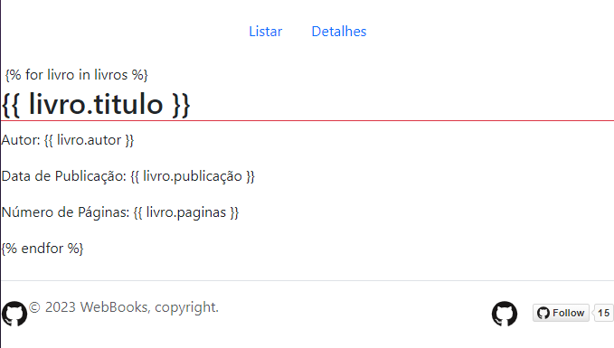

> 💻 - *OBS:* Não iniciei o server para mostrar o Site, apenas abri o HTML, por isso aparece os "{{ livro.titulo }}", pois apenas abrir um arquivo HTML não irá funcionar o banco.

### **5.2.** *Configurando Arquivos Estáticos*

- Agora você precisa configurar seu aplicativo para servir arquivos estáticos corretamente durante o desenvolvimento e implantação.

##### 1. Abra o arquivo de configuração `settings.py`, como por exemplo (`WebBooks/setup/settings.py`) e coloque o codigo `import os` no topo.

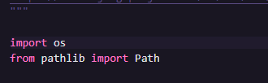

##### 2. Vá até a seção **TEMPLATES** e faça as seguintes alterações como no exemplo:

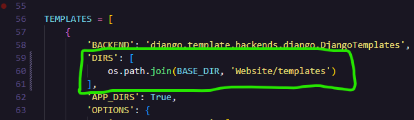

>🔩 - Isso mostrará ao Django que o seu TEMPLATES está localizado no seu app em um arquivo chamado `templates`

##### 3. Vá até a seção **STATIC_URL** e faça as seguintes alterações como no exemplo:

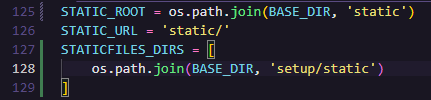

>🔩 - Isso mostrará ao Django que o seu comando é `static`, que localiza a pasta através da URL `static/`, onde os arquivos bases estão localizados em `setup/static`

### **5.3.** *Arquivos Estáticos (CSS, JS, Imagens)*

- Os arquivos estáticos, como CSS, JavaScript e imagens, podem ser usados para estilizar e enriquecer seu site. Vamos configurar os arquivos estáticos.

##### 1. Crie uma pasta chamada `static` no diretório setup do seu projeto (por exemplo, `WebBooks/setup/static`)

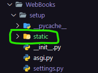

##### 2. Dentro dela crie subpastas para armazenar arquivos estáticos como `css`, `js` e `img` logo depois adicione e carregue todos os arquivos CSS, JavaScript e Imagens nessas pastas conforme necessário.

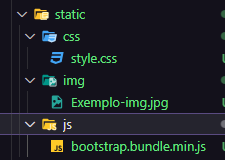

##### 3. No HTML onde está sendo utilizado esses recursos vão ser atualizado os códigos para Imagens e Links (Hrefs, Src, Script, etc.)

> - Coloque o código `` no topo do HTML, pois ele serve para recarregar todos os componentes de dentro da pasta Static.
> - Modifique os codigos que contém Href, Src e Script que tiverem redirecionamento por diretórios como `src= 'css/style.css'`.
> - Na modificação você colocará o código ``, por favor, respeite os espaços e a forma que é escrita o código, senão falhará.

- Exemplo:

**Antes -**
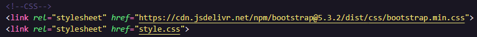

**Depois -**
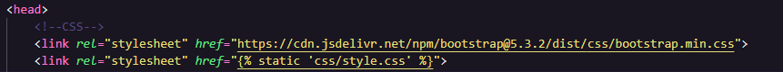

> 🗂️ - *OBS:* Não há necessidade de fazer isso com Links "http" como no exemplo, eles não são links de pasta. Agora modifique todos os códigos que contem esses recursos de Href, Src ou Script para que seu site funcione corretamente.

- Seu codigo ficará assim:
```bash

<!DOCTYPE html>
<html>
    <head>
        <!--CSS-->
        <link rel="stylesheet" href="">
        <link rel="stylesheet" href="https://cdn.jsdelivr.net/npm/bootstrap@5.3.2/dist/css/bootstrap.min.css">
        <!--Titulo-->
        <title>Detalhes do Livro</title>
    </head>
    <body class="bg-gray">
        <!--Header-->
        <header class="bg-gray d-flex justify-content-center py-3">
            <ul class="nav nav-pills">
              <li class="nav-item"><a href="../" class="nav-link" aria-current="page">Listar</a></li>
              <li class="nav-item"><a href="../detalhes" class="nav-link">Detalhes</a></li>
            </ul>
        </header>
        <!--Main-->
        <main class="bg-gray">
            
            
                <h1 class="bg-gray border-bottom border-danger">{{ livro.titulo }}</h1>
                <p class="bg-gray">Autor: {{ livro.autor }}</p>
                <p>Data de Publicação: {{ livro.publicação }}</p>
                <p>Número de Páginas: {{ livro.paginas }}</p>
            
        </main>
        <!--Footer-->
        <footer class="bg-gray d-flex flex-wrap justify-content-between align-items-center py-3 my-4 border-top">
            <div class="col-md-4 d-flex align-items-center">
              <a href="https://github.com/DaviVidal01">
                
              </a>
              <span class="mb-3 mb-md-0 text-body-secondary">© 2023 WebBooks, copyright.</span>
            </div>
        
            <ul class="nav col-md-4 justify-content-end list-unstyled d-flex">
              <li class="ms-3"><a class="text-body-secondary" href="https://github.com/DaviVidal01"></a></li>
              <li class="ms-3"><a href="https://github.com/DaviVidal01/"></a></li>
            </ul>
          </footer>
        <!--Scripts-->
        <script src=""></script>
    </body>
</html>
```
> - **:** Isso carrega os arquivos estáticos para que você possa usar a tag `` para referenciar seus arquivos CSS, JavaScript, imagens, etc.
> - **:** Isso carrega um arquivo CSS estático usando a tag ``, pegando o arquivo que está dentro da pasta `static`.

##### 4. Abrir o terminal ou prompt de comando e navegar até o diretório Raiz/Pai do seu projeto e realizar o comando:

```bash
python ./manage.py collectstatic
```

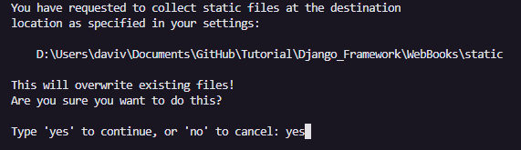

- Se já tiver arquivos dentro da pasta Static, ele vai perguntar se deseja copia-los, ele logo enviará a cópia para onde os arquivos static que você redirecionou na `settings.py`

- Por fim quando você iniciar o Runserver ensinado na etapa [**1.6.3**](#3-agora-que-você-está-na-pasta-do-projeto-e-com-o-ambiente-virtual-ativado-você-pode-iniciar-o-servidor-de-desenvolvimento-com-o-seguinte-comando), e depois digitar a URL `detalhes/`, seu site carregará todos os Statics, carregará o Banco e ficará assim:

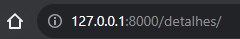

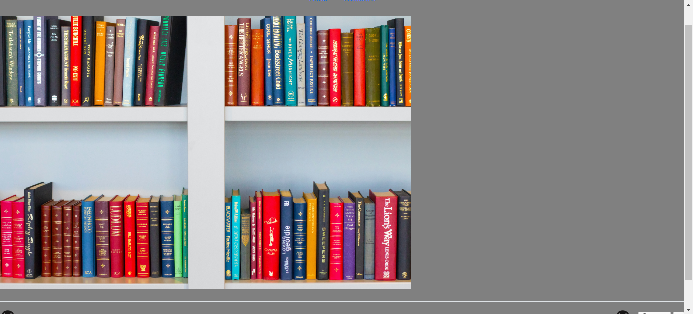

### **5.4.** *Uso de Modelos Parciais (Partial Templates):*

- Modelos parciais, também conhecidos como "partials," são partes reutilizáveis de um modelo HTML que você pode incluir em várias páginas. Eles são úteis para manter seu código limpo e evitar a duplicação de HTML.

##### 1. Navegue até a pasta `templates` dentro do seu app e crie uma pasta chamada `partials` (exemplo `Website/templates/partials`).

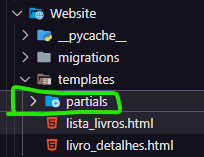

##### 2. Crie 2 arquivos HTML dentro dessa pasta `partials`, um chamado `footer.html` e outro `header.html`, dentro de cada um deles será colocado os seguintes códigos.

>🔔 # Lembra dos comentários do seu HTML? (exemplo, `<!--HEADER-->`), você pegará cada parte do código que está dentro do `<body>...</body>`, como o `<!--HEADER-->` e `<!--FOOTER-->`

**Footer:**
```bash
    <footer class="bg-gray d-flex flex-wrap justify-content-between align-items-center py-3 my-4 border-top">
        <div class="col-md-4 d-flex align-items-center">
          <a href="https://github.com/DaviVidal01">
            
          </a>
            <span class="mb-3 mb-md-0 text-body-secondary">© 2023 WebBooks, copyright.</span>
        </div>
        
        <ul class="nav col-md-4 justify-content-end list-unstyled d-flex">
            <li class="ms-3"><a class="text-body-secondary" href="https://github.com/DaviVidal01"></a></li>
            <li class="ms-3">
                <a href="https://github.com/DaviVidal01/">
                    
                </a>
            </li>
        </ul>
    </footer>
```

**Header:**
```bash
    <header class="bg-gray d-flex justify-content-center py-3">
        <ul class="nav nav-pills">
            <li class="nav-item"><a href="../" class="nav-link" aria-current="page">Listar</a></li>
            <li class="nav-item"><a href="../detalhes" class="nav-link">Detalhes</a></li>
        </ul>
    </header>
```

- Não esqueça de colocar o `` no topo dos HTMLs `header.html` e `footer.html`

##### 3. Agora no lugar de onde você tirou o código de cada um desses 2 comentários, você substituirá por ``, como está no exemplo:

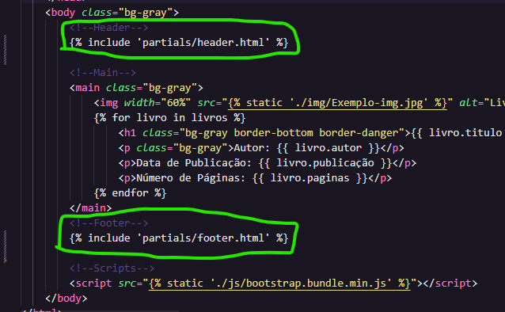

-Se você testar com Runserver ensinado na etapa [**1.6.3**](#3-agora-que-você-está-na-pasta-do-projeto-e-com-o-ambiente-virtual-ativado-você-pode-iniciar-o-servidor-de-desenvolvimento-com-o-seguinte-comando), poderá ver quer o Footer e o Header estão todos ali.


- Outra forma de identifica-los é indo em Inspecionar Elemento (`botão direito do mouse`)


##### EXTRA. Faça a mesma coisa com a página `lista_livros.html`

```bash

<!DOCTYPE html>
<html>
    <head>
        <!--CSS-->
        <link rel="stylesheet" href="">
        <link rel="stylesheet" href="https://cdn.jsdelivr.net/npm/bootstrap@5.3.2/dist/css/bootstrap.min.css">
        <!--Titulo-->
        <title>Lista de Livros</title>
    </head>
    <body class="bg-gray">
        <!--Header-->
        

        <!--Main-->
        <main class="bg-gray">
            <h1>Lista de Livros</h1>
            <ul>
                
                <li>{{ livro.titulo }} por {{ livro.autor }}</li>
                
            </ul>
        </main>
        <!--Footer-->
        

        <!--Scripts-->
        <script src=""></script>
    </body>
</html>
```

> 📌 # Lembrando que Partials é bastante criado para que não haja repetições de códigos, caso você tenha várias páginas com o mesmo navbar(Header) e o mesmo footer, você pode estar utilizando partials além de várias outras para facilitar seu código e não necessitar escrever linhas e linhas repetidamente.

### **5.5.** *Templates e Layouts:*

> 🔔 # Para manter seu código mais organizado, você pode criar na pasta `templates` os layouts. Por exemplo, você pode criar um arquivo `base.html` que define o layout geral do site e usar tags de inclusão para incluir outros templates parciais.

##### 1. Crie um arquivo HTMl chamado `base.html` em sua pasta de `templates`


##### 2. Coloque o conteúdo base que tem em todas as páginas do seu site em `base.html`, como o HEAD, BODY, SCRIPTS e CSS para que não haja repetição de código.

```bash
    
<!DOCTYPE html>
<html>
    <head>
        <!--CSS-->
        <link rel="stylesheet" href="">
        <link rel="stylesheet" href="https://cdn.jsdelivr.net/npm/bootstrap@5.3.2/dist/css/bootstrap.min.css">
        <!--Titulo-->
        <title>WebBooks - </title>
    </head>
    <body class="bg-gray">
        
        
        <!--Scripts-->
        <script src=""></script>
    </body>
</html>
```

> - **:** Este é um bloco de conteúdo que outras páginas estendidas podem preencher com seu próprio conteúdo, ela se estende até onde o codigo localizar o chamado ``.
> - **:** Este é um bloco que permite que outras páginas estendam este modelo e forneçam seu próprio título, ela se estende até onde o codigo localizar o chamado ``.
>>📌 # Outros templates podem estender o `base.html` e preencher os blocos de conteúdo.

##### 3. Agora podemos substituir os códigos repetidos por ``(para determinar o início do conteúdo) e ``(para determinar o fim do conteúdo)

- É importante que o comando `` esteja no topo de tudo, pois ele determina qual é o Layout base para a página preencher os conteúdos.

**lista_livros.html:**
```bash



<title>Lista de Livros</title>
        <!--Header-->
        

        <!--Main-->
        <main class="bg-gray">
            <h1>Lista de Livros</h1>
            <ul>
                
                <li>{{ livro.titulo }} por {{ livro.autor }}</li>
                
            </ul>
        </main>
        <!--Footer-->
        

```

**livro_detalhes.html:**
```bash



<title>Livro Detalhes</title>
        <!--Header-->
        

        <!--Main-->
        <main class="bg-gray">
            
            
                <h1 class="bg-gray border-bottom border-danger">{{ livro.titulo }}</h1>
                <p class="bg-gray">Autor: {{ livro.autor }}</p>
                <p>Data de Publicação: {{ livro.publicação }}</p>
                <p>Número de Páginas: {{ livro.paginas }}</p>
            
        </main>
        <!--Footer-->
        

```

- Depois de preencher corretamente e iniciar o Runserver ensinado na etapa [**1.6.3**](#3-agora-que-você-está-na-pasta-do-projeto-e-com-o-ambiente-virtual-ativado-você-pode-iniciar-o-servidor-de-desenvolvimento-com-o-seguinte-comando), você poderá ver que o site funcionará normalmente, pois as Partials e Layout (base.html) se juntam com os templates formando um "Quebra-Cabeça".


> 🔔 # Dessa forma, você pode criar páginas HTML de maneira organizada, estendendo um modelo principal e preenchendo os blocos de conteúdo conforme necessário. Isso torna seu código mais modular e fácil de gerenciar.

### **5.6.** *Configurando Arquivos de Mídia e Imagens do Banco:*

- Arquivos de mídia, como imagens enviadas pelos usuários dentro do seu site, podem ser armazenados em uma pasta separada. Configure as configurações de mídia no `settings.py` que fica localizado na setup do seu site (exemplo, `WebBooks/setup/settings.py`).

##### 1. Escreva os seguintes códigos nas últimas linhas de `settings.py`

```bash
MEDIA_URL = '/media/'
MEDIA_ROOT = os.path.join(BASE_DIR, 'media')
```

> 🎛️ - Esse código faz com que o Django encontre a pasta chamada `media` dentro do seu diretório Raiz/Pai do projeto, e lá ele começará a armazenar dados e informações como imagens, arquivos, etc. Que forem adicionados pelos usuários de seu site, ou até mesmo pelos adm.

##### 2. Ainda no diretório do seu `setup` procure o arquivo chamado `urls.py`, normalmente localizado abaixo do arquivo `settings.py` e escreva os seguintes códigos

**No topo:**
```bash
from django.conf import settings
from django.conf.urls.static import static
```

**Nas últimas linhas:**
```bash
if settings.DEBUG:
    urlpatterns += static(settings.MEDIA_URL, document_root=settings.MEDIA_ROOT)
```

- Exemplo:


##### 3. Crie uma pasta chamada `media` dentro do diretório Raiz/Pai do seu projeto


- Agora você está pronto para usar arquivos de mídia em sua aplicação.


##### 4. Vamos agora reconfigurar a `models.py` para que possa receber imagens adicionadas pelo SUPERUSER e armazena-las, além de exibi-las no site `lista_livros.html`

**Models Atualizado:**
```bash
from django.db import models

# Create your models here.

class Livro(models.Model):
    titulo = models.CharField(max_length=200)
    autor = models.CharField(max_length=100)
    capa = models.ImageField(default='', upload_to= './images')
    #Dentro da pasta Media vai ser criada images que armazenará esses itens
    publicação = models.DateField()
    paginas = models.IntegerField()
```

- Realiza o `python ./manage.py makemigrations` e vai gerar um ERRO:


- Você irá baixar o Pillow, lembre-se de estar com a Venv ligada.
```bash
python -m pip install Pillow
```

- Agora realize o `makemigrations` e `migrate` para que a atualização do banco possa ser completada.


- Vamos atualizar também a página `lista_livros.html` para que ele possa exibir essas informações

```bash



<title>Lista de Livros</title>
        <!--Header-->
        

        <!--Main-->
        <main class="bg-gray">
            <h1>Lista de Livros</h1>
            <ul>
                
                <li>{{ livro.titulo }} por {{ livro.autor }}</li>
                <li>
                    
                        
                    
                        <p>Capa não encontrada</p>
                    
                </li>
                
            </ul>
        </main>
        <!--Footer-->
        

```

> - **{{ livro.capa.url }}:** O contador "livro" pega as informações adicionadas no campo "capa" e redireciona sua URL para dentro do `src` assim apresentando todas as imagens por vez, por conta do contador estar dentro do **FOR**.
>> 📌 - Os contadores sempre são identificados como IDs, então para apresentar imagens ou itens separadamente, utiliza-se `{{ 1.capa.url }}` por exemplo. Isso funciona para outros recursos e campos também, tudo que é feito no banco deve a ser identificado a partir de sua **Primary_Key**.

---------------------------------------------------------------

## 📗 Fase 6: MVT (Model-View-Template) e Integração

> 🔔 # Nesta fase, você entenderá como o padrão MVT funciona no Django, que é semelhante ao famoso padrão MVC (Model-View-Controller), e como integrar os modelos, views e templates para criar páginas da web dinâmicas.

> **Entendendo o Padrão MVT:**
>> - `Model (Modelo):` Os modelos representam a estrutura dos dados e a lógica de negócios. Eles são responsáveis por interagir com o banco de dados e fornecer dados para as views.
>> - `View (Visão):` As views são responsáveis por processar solicitações HTTP, interagir com os modelos para obter dados e renderizar as respostas. As views geralmente correspondem às páginas da web.
>> - `Template (Modelo de Apresentação):` Os templates são arquivos HTML que definem como os dados serão apresentados. Eles usam a linguagem de modelo do Django para inserir dados dinâmicos nas páginas.

### **6.1.** *Integrando Model, View e Template*

> 📝 # Você já integrou a Model com o Template utilizando a Views nas etapas anteriores, então essa fase é apenas para estudar o MVT que já fizemos, vamos pegar uma parte dos códigos para analisa-los.

`view.py:`
```bash
from django.shortcuts import render
from .models import Livro

def lista_livros(request):
    livros = Livro.objects.all()
    return render(request, 'myapp/lista_livros.html', {'livros': livros})
```

`lista_livros.html:`
```bash
<!DOCTYPE html>
<html>
<head>
    <title>Lista de Livros</title>
</head>
<body>
    <h1>Lista de Livros</h1>
    <ul>
        
        <li>{{ livro.título }} por {{ livro.autor }}</li>
        
    </ul>
</body>
</html>
```

### **6.2.** *Compreendendo a Integração*

> - A view (view.py) chama o modelo (Livro) para obter dados dos livros adicionados.
> - A view passa esses dados para o template.
> - O template usa a linguagem de modelo do Django (as tags `` e `{{ }}`) para exibir os dados na página.

- Dessa forma, o padrão MVT do Django permite que você crie páginas da web dinâmicas, onde os dados são buscados a partir dos modelos, processados nas views e apresentados nos templates.

### **6.3.** *Divisão das responsabilidades MVT*

##### 🗂️ Model (Modelo):
- O modelo é responsável por lidar com os dados do aplicativo, definindo sua estrutura e manipulação.
- Representa o acesso aos dados, incluindo a leitura, gravação e consulta de informações no banco de dados.
- Os modelos no Django são representados como classes Python que definem a estrutura do banco de dados.
- Os modelos são independentes da camada de interface do usuário e do controle de visualização.

##### 👀 View (Visualização):
- A camada de visualização lida com a lógica da aplicação e controla o fluxo de informações entre o modelo e o template.
- As visualizações recebem solicitações do navegador do usuário, processam essas solicitações e interagem com o modelo para buscar ou salvar dados.
- Eles também decidem qual template deve ser usado para renderizar a resposta.
- As visualizações são escritas em Python e podem retornar respostas em HTML, JSON, XML ou outros formatos.

##### 🖼️ Template (Modelo de Apresentação):
- Os modelos de apresentação (templates) são responsáveis pela renderização de HTML e pela apresentação da interface do usuário.
- Eles definem como os dados são exibidos nas páginas da web, combinando conteúdo estático e dinâmico.
- Os templates utilizam uma linguagem de marcação especial chamada Django Template Language (DTL) para inserir variáveis, estruturas condicionais e loops nos modelos.
- Os templates são projetados para serem reutilizáveis e podem incluir tags, filtros e blocos para facilitar a criação de páginas consistentes.

##### 🎛️ Integração MVT:
- Quando um usuário acessa uma página no aplicativo, uma solicitação é enviada para o servidor Django.
- A visualização apropriada é mapeada para essa solicitação com base nas configurações de URL.
- A visualização interage com o modelo, se necessário, para recuperar ou salvar dados no banco de dados.
- A visualização seleciona o template a ser usado para renderizar a resposta.
- O template usa o Django Template Language para preencher o conteúdo dinâmico com base nos dados do modelo.
- A resposta é gerada e enviada de volta para o navegador do usuário.

> 🔩 # Essa arquitetura facilita a separação de preocupações em um aplicativo Django. Os modelos cuidam dos dados, as visualizações tratam da lógica e as templates controlam a apresentação. Isso torna o desenvolvimento mais organizado e permite que diferentes partes do aplicativo sejam modificadas independentemente.
---------------------------------------------------------------

## 📗 Fase 7: Administração do Django

> 🔔 # O Django fornece um painel de administração integrado que facilita a tarefa de gerenciar os dados de seu aplicativo. Nesta fase, você aprenderá a habilitar e personalizar o painel de administração do Django.

### **7.1.** *Habilitar o Painel de Administração*

> 💼 # Nós já criamos um superusuário e colocando os comandos no arquivo `admin.py` de dentro do seu app, é só seguir as etapas [3.3](#33-django-admin) e [3.4](#34-criar-superusuário).

- Mas escrevendo apenas `admin.register(Livro)` não possibilitará a criação de novos Livros, apenas conseguirá ver todos os registros de cada Livro, então adicione `.site` no meio como no exemplo:

`admin.py:`


**Visualização:**


### **7.2.** *Personalizar a Interface de Administração*

> 💼 # Você pode personalizar a interface de administração do Django de várias maneiras, como a seguir:

##### 1. Conhecendo o ModelAdmin:

- **ModelAdmin:** Você pode criar uma classe `ModelAdmin` para personalizar a forma como os modelos são exibidos no painel de administração. Por exemplo, você pode definir campos para serem exibidos, filtros e ações personalizadas.

```bash
from django.contrib import admin
from .models import Livro

@admin.register(Livro)
class LivroAdmin(admin.ModelAdmin):
    list_display = ('titulo', 'autor', 'publicação')
    list_filter = ('autor', 'publicação')
```

**Visualização:**


> - **list_display = ('titulo', 'autor', 'publicação'):** Ele acaba exibindo as informações de Titulo, Autor e Publicação na página do Admin, como informações principais.
> - **list_filter = ('autor', 'publicação'):** É utilizado o Autor e Publicação (data) para filtrar os Livros, você consegue filtrar vários livros que foram feitos por 1 Autor ou em uma data/ano específico.

> 📚 *OBS:* O livro que está adicionado, foi criado para a realização do teste, vamos aprender a adicionar itens no Django Admin na próxima etapa.

##### 2. Algumas personalizações interessantes:

> 🔩 # É importante lembrar que se o seu models (banco de dados) estiver com mais detalhes e campos, ficará mais interessante usar e abusar dessas personalizações.

- No nosso caso, apresentarei apenas as personalizações que ficaram bons para esse Models Simples

`Filtros Simples:`
```bash
    list_filter = ('autor', 'publicação')
    #Aqui ele criará filtros com esses 2 campos
```


`Lista de Apresentação`:
```bash
    list_display = ('titulo', 'autor', 'publicação')
    #Aqui ele apresentará esses 3 campos
```


`Barra de Pesquisa:`
```bash
    search_fields = ('titulo', 'autor')
    #Aqui ele só procurará pesquisas referentes a esses 2 campos.
```


`Complementação de Dados:`
```bash
    fieldsets = [
        ('Informações Básicas', {'fields': ['titulo', 'autor', 'publicação']}),
        ('Detalhes Adicionais', {'fields': ['paginas', 'capa']}),
    ]
    #Aqui ele separará o formulário do admin com 2 etapas "Informações Básicas" e "Detalhes Adicionais"
```


**Como o código é escrito:**


- Para mais personalizações, você pode estar pesquisando na documentação do [Django Admin](https://docs.djangoproject.com/en/4.2/ref/contrib/admin/) ou pesquisando em outras fontes.

### **7.3.** *Adicionar Informações no Banco de Dados*

> 📚 # Essa etapa não tem muito segredo, é uma interface bem simples de se usar.


- Você possui 2 opções, "Add" ou "Change", `Add` servirá para adicionar novos itens enquanto o `Change` servirá para edita-los.


> 📚 # Nesse ambiente você poderá preencher as lacunas com as informações necessárias e depois escolher entre as 3 opções
>> - **Salvar:** Salvar e Sair.
>> - **Salvar e Adicionar Outro:** Salvar e começar a editar outra ficha.
>> - **Salvar e Continuar Editando:** Salvar e continuar na mesma ficha, caso ela seja grande demais ou queira usar para testes.

- Quando salvar e abrir o Workbench MySQL, poderá ver que seus itens adicionados estaram no banco registrados.

**Para ver siga as instruções:**

`Passo 1: Abrir o Servidor`


`Passo 2: Entrar no Schema`


`Passo 3: Localizar o seu Schema`


`Passo 4: Clicar na mini-tabela`


`Passo 5: Admirar seu item no banco`


`Passo 6: Realizar Runserver e ver seus itens no site`

**lista_livros:**


**livro_detalhes:**


### **7.4.** *Autorizações e Usuários*

> 🔔 # Essa parte é configurada quando se está trabalhando em equipe para algum serviço grande, podendo permitir ou negar acesso de certos usuários que estão tentando entrar no `admin/`

##### 👤 Conceitos de Users(Usuários):

- Os "Users" (Usuários) se referem aos indivíduos que têm acesso à sua aplicação. Cada usuário possui uma conta única, geralmente identificada por um nome de usuário (username) e uma senha.
- Usuários são responsáveis por autenticar na aplicação (fazer login) e interagir com funcionalidades específicas com base nas permissões concedidas a eles.
- No Django, o modelo de usuário padrão já está incluído e é altamente configurável. Você pode adicionar informações personalizadas aos perfis de usuário, como nome completo, endereço de e-mail, etc.
- Os usuários também podem ser atribuídos a grupos para facilitar o gerenciamento de permissões.

##### 👥 Conceitos de Groups(Grupos):

- Os "Groups" (Grupos) são conjuntos lógicos de permissões. Eles são usados para organizar usuários com permissões semelhantes em categorias ou grupos.
- Em vez de atribuir permissões a cada usuário individualmente, você pode criar grupos com permissões predefinidas e, em seguida, atribuir usuários a esses grupos.
- Isso simplifica a administração de permissões, especialmente quando você tem muitos usuários com as mesmas permissões.
- Por exemplo, você pode criar grupos como "Admins," "Editores," "Leitores," e atribuir as permissões apropriadas a cada grupo.
- Em seguida, você pode adicionar ou remover usuários desses grupos para conceder ou revogar permissões em lote.

##### 🎛️ Funcionamento Prático:

- No Django admin, você pode gerenciar usuários e grupos na seção "Authentication and Authorization".
- Você pode criar, editar e excluir usuários, bem como criar e gerenciar grupos.
- Ao criar ou editar um usuário, você pode definir seu nome de usuário, senha e outras informações. Além disso, você pode especificar a qual grupo o usuário pertence.
- Ao configurar permissões para um grupo, você define o que os usuários desse grupo podem fazer em relação aos modelos (tabelas do banco de dados) da sua aplicação. Isso inclui permissões de visualização, adição, alteração e exclusão.
- No modelo padrão de autenticação do Django, há grupos predefinidos, como "Admin," "Staff," e "Superuser," cada um com diferentes conjuntos de permissões. Você pode personalizar esses grupos ou criar novos de acordo com suas necessidades.

### **7.5.** *Traduzindo Painel Admin*

>🎛️ # Vamos agora traduzir a página do seu Admin Django, para que seja da sua facilidade de leitura.

##### 1. Para traduzir o painel admin do Django, você deverá ir até o arquivo `settings.py` do seu projeto (`WebBooks/setup/settings.py`)

##### 2. Vá até a seção de LANGUAGE_CODE, lá você substituirá os códigos do TIME_ZONE e LANGUAGE_CODE para:

```bash
LANGUAGE_CODE = 'pt-br'

TIME_ZONE = 'America/Sao_Paulo'
```


> 🔔 # Agora você pode usar o painel de administração para adicionar, editar e excluir registros de seu banco de dados de forma conveniente. Nesta fase, você aprendeu a habilitar e personalizar o painel de administração do Django. Na próxima fase, exploraremos como criar formulários e lidar com validação de dados.
---------------------------------------------------------------

## 📗 Fase 8: Formulários e Validação

> 🔔 # Nesta fase, você aprenderá como criar formulários para coletar dados do usuário e como realizar a validação desses dados.

### **8.1.** *Criando um Formulário*

- Para criar um formulário, você deve criar uma classe que herde de `forms.Form`. Vamos criar um exemplo de formulário para adicionar novos livros:

##### 1. Crie e abra o arquivo `forms.py` em seu aplicativo (por exemplo, `Website/forms.py`).


##### 2. Crie um formulário para adicionar novos livros

- Os campos de dentro de `LivroForm` devem ser iguais aos que foram criados no `models.py`, 'titulo', 'autor', 'publicação', 'paginas' e 'capa'.

```bash
from django import forms

class LivroForm(forms.Form):
    titulo = forms.CharField(label='Título', max_length=100)
    autor = forms.CharField(label='Autor', max_length=100)
    publicação = forms.DateField(label='Data de Publicação')
    paginas = forms.IntegerField(label='Número de Páginas')
    capa = forms.ImageField(label='Capa do Livro')
```

> - **forms.Form:** Ele importa recursos de `forms`, recursos esses guardados em `Form` e adiciona dentro da `class`.
> - **forms.CharField:** Pega de `forms` a ferramenta chamada `CharField` que registra Caracteres.
> - **forms.DateField:** Pega de `forms` a ferramenta chamada `DateField` que registra Datas.
> - **forms.IntegerField:** Pega de `forms` a ferramenta chamada `IntegerField` que registra Números Inteiros.
> - **forms.ImageField:** Pega de `forms` a ferramenta chamada `ImageField` que registra arquivos Imagens
>> Mais informações de ferramentas de armazenamento no banco de dados `Field` estão na documentação do [Django Models Field References](https://docs.djangoproject.com/en/4.2/ref/models/fields/)

### **8.2.** *Renderizando o Formulário em uma View*

- Agora que você criou o formulário, você pode renderizá-lo em uma view.

##### 1. Abra o arquivo `views.py` em seu aplicativo.

##### 2. Importe o formulário que você criou no topo do código e adiciona ao lado de "`render`" um chamado `redirect` para redirecionamento de páginas:

**Ficará assim:**
```bash
from django.shortcuts import render, redirect
from .models import Livro
from .forms import LivroForm
```
##### 3. Crie uma view que renderiza o formulário:

```bash
def adicionar_livro(request):
    if request.method == 'POST':
        livro_form = LivroForm(request.POST, request.FILES)
        if livro_form.is_valid():
            novo_livro = Livro(
                titulo= livro_form.cleaned_data['titulo'],
                autor= livro_form.cleaned_data['autor'],
                publicação= livro_form.cleaned_data['publicação'],
                paginas= livro_form.cleaned_data['paginas'],
                capa = livro_form.cleaned_data['capa']
            )
            novo_livro.save() 

            return redirect('lista_livros')
    else:
        livro_form = LivroForm()

    return render(request, 'adicionar_livro.html', {'livro_form': livro_form})
```

> - **def adicionar_livro(request):** Isso define uma função de view chamada `adicionar_livro` que é chamada quando alguém acessa a URL correspondente.
> - **if request.method == 'POST':** Esta linha verifica se a solicitação é uma solicitação `POST`. Em Django, isso geralmente é usado para processar formulários enviados. Se a solicitação for um `POST`, significa que alguém enviou um formulário de adição de livro.
> - **livro_form = LivroForm(request.POST, request.FILES):** Aqui, estamos criando uma instância do formulário `LivroForm` com os dados da solicitação `POST`. Estamos passando tanto `request.POST` quanto `request.FILES`, porque este formulário inclui um campo de upload de arquivo para a *capa do livro* e o `request.FILES` contribui para o tratamento desses arquivos.
> - **if livro_form.is_valid():** Esta linha verifica se os dados fornecidos no formulário são válidos de acordo com as regras definidas no formulário `LivroForm`. Se o formulário for válido, isso significa que os dados do livro são preenchidos corretamente.
> - **novo_livro = Livro(...):** Aqui, estamos criando uma instância do modelo `Livro` com base nos dados fornecidos no formulário *(Os campos tem de terem o mesmo nome que o Formulário)*. Estamos pegando os valores do 'título', 'autor', 'data de publicação', 'número de páginas' e a 'capa' do formulário e atribuindo-os a um novo objeto `Livro`.
> - **novo_livro.save():** Esta linha salva o novo livro no banco de dados. Após a execução desta linha, o livro será armazenado permanentemente no banco de dados.
> - **return redirect('lista_livros'):** Após salvar o livro com sucesso, redirecionamos o usuário para a página '`lista_livros`', que exibirá a lista atualizada de livros.
> - **else:** Se a solicitação não for um `POST`, isso significa que é a primeira vez que alguém acessa a página ou enviou um formulário inválido.
> - **livro_form = LivroForm():** Aqui, estamos criando uma instância vazia do formulário `LivroForm`. Isso é feito para exibir um formulário em branco para o usuário quando ele acessa a página pela primeira vez.
> - **return render(request, 'adicionar_livro.html', {'livro_form': livro_form}):** Se a solicitação não for um `POST`, estamos renderizando a página '`adicionar_livro.html`' e passando o formulário `livro_form` como contexto. Isso exibe o formulário em branco para o usuário, para que possa ser repreenchido corretamente.

### **8.3.** *Criando um Template para o Formulário*

- Agora você precisa criar um template HTML para o formulário. Vamos criar um arquivo chamado `adicionar_livro`.html em sua pasta de templates.


```bash



<title>Adicionar Livro</title>
    <!--Header-->
    
    <main>
        <h1>Adicionar Livro</h1>
        <form method="post" enctype="multipart/form-data">
            
            {{ livro_form.as_p }}
            <button type="submit">Adicionar Livro</button>
        </form>
    </main>
    <!--Footer-->
    

```

> - **method="post" enctype="multipart/form-data":** Aqui, você está criando um elemento de formulário HTML usando a tag `<form>`. O atributo `method` está definido como "post", o que significa que o formulário será enviado como uma solicitação `POST` quando o usuário o enviar. O atributo `enctype` está definido como "multipart/form-data". Isso é necessário quando você tem campos de entrada do tipo "file" (como o campo de upload de imagem), pois permite o envio de arquivos binários. O valor "multipart/form-data" é usado para formulários que contêm campos de upload de arquivo.
> - ****: Esta é uma tag do Django template que insere um token de segurança `CSRF (Cross-Site Request Forgery)` no formulário. Isso é importante para proteger seu aplicativo contra ataques `CSRF`. Quando o formulário é enviado, o Django verifica se o token é válido.
> - **{{ livro_form.as_p }}**: Esta é outra tag do Django template. `livro_form` é uma instância do seu formulário `LivroForm`. `as_p` é um método que renderiza o formulário com cada campo `(título, autor, etc.)` em um parágrafo `(<p>)`. Isso cria uma representação simples do formulário, onde cada campo do formulário é exibido em um novo parágrafo.
> - **type="submit"**: Este é colocado em um botão de envio no formulário. Quando o usuário clica neste botão, o formulário é enviado para o servidor. O atributo type está definido como "submit", o que significa que este botão é usado para enviar o formulário. O texto "Adicionar Livro" é o rótulo do botão exibido para o usuário.
>> 🎨 OBS: Tem várias outras formas de criar Inputs personalizados, utilizando CSS/HTML, além de outras formas de apresentar o formulário, basta usar a criatividade.

- Vamos mudar algumas coisas no nosso Header, localizado dentro do `templates/partials/header.html`

**header.html:**
```bash

<header class="bg-gray d-flex justify-content-center py-3">
    <ul class="nav nav-pills">
      <li class="nav-item"><a href="../" class="nav-link" aria-current="page">Listar</a></li>
      <li class="nav-item"><a href="../detalhes" class="nav-link">Detalhes</a></li>
      <li class="nav-item"><a href="../adicionar" class="nav-link">Adicionar</a></li>
    </ul>
</header>
```


### **8.4.** *Personalizando Formulário Template*

- Você pode personalizar a aparência dos campos do formulário usando CSS. Vou fornecer um exemplo de como você pode criar inputs com labels mais estilizados 

**adicionar_livro.html:** (Cole onde fica o form)
```bash
<form method="post" enctype="multipart/form-data" action="">
    
    <div class="form-group">
        <label for="{{ livro_form.titulo.id_for_label }}">Título:</label>
        {{ livro_form.titulo }}
    </div>
    <div class="form-group">
        <label for="{{ livro_form.autor.id_for_label }}">Autor:</label>
        {{ livro_form.autor }}
    </div>
    <div class="form-group">
        <label for="{{ livro_form.publicacao.id_for_label }}">Data de Publicação:</label>
        {{ livro_form.publicacao }}
    </div>
    <div class="form-group">
        <label for="{{ livro_form.paginas.id_for_label }}">Número de Páginas:</label>
        {{ livro_form.paginas }}
    </div>
    <div class="form-group">
        <label for="{{ livro_form.capa.id_for_label }}">Capa do Livro:</label>
        {{ livro_form.capa }}
    </div>
    <button type="submit">Adicionar Livro</button>
</form>
```

**style.css:** (Cole isso nos dois arquivos style.css localizado nas 2 pastas STATIC criadas)
```bash
/* Estilos gerais para o formulário */
.form-group {
    margin-bottom: 20px;
}

label {
    font-weight: bold;
    display: block;
}

/* Estilos para os inputs */
input[type="text"],
input[type="date"],
input[type="number"],
input[type="file"] {
    width: 100%;
    padding: 10px;
    border: 1px solid #ccc;
    border-radius: 5px;
    font-size: 16px;
}

/* Estilos para o botão */
button {
    background-color: #007BFF;
    color: #fff;
    padding: 10px 20px;
    border: none;
    border-radius: 5px;
    cursor: pointer;
}

button:hover {
    background-color: #0056b3;
}
```

- Realize o comando e depois o Runserver:
```bash
python manage.py collectstatic
```


> - **action=""**: O atributo action em uma tag `<form>` define para onde os dados do formulário serão enviados quando o usuário o submeter. Neste caso, "``" é uma tag do Django que resolve dinamicamente a URL para a view chamada '`adicionar_livro`'. Isso significa que quando o formulário é enviado, os dados serão processados pela view chamada '`adicionar_livro`'.
> - **for="{{ livro_form.autor.id_for_label }}"**: Esse é um atributo for de uma tag `<label>`. As tags `<label>` são usadas para rotular campos de entrada em um formulário. Neste caso, o atributo for está configurado para o campo '`autor`' do formulário `(livro_form.autor)`. O valor `livro_form.autor.id_for_label` é uma forma dinâmica de gerar um ID para o campo de entrada '`autor`'. Isso está relacionado à acessibilidade, permitindo que a etiqueta esteja associada corretamente ao campo de entrada. Dessa forma, quando o usuário clica no rótulo, o foco é direcionado para o campo '`autor`'.
> - **{{ livro_form.autor }}**: Esta é uma variável do Django template que renderiza o campo de entrada '`autor`' do formulário. O que é renderizado depende do tipo do campo '`autor`' em seu formulário. Se for um campo `CharField`, por exemplo, isso renderizará um campo de texto de entrada. Se for um campo `DateField`, renderizará um campo de entrada de data. O Django gera automaticamente o HTML necessário para o campo, com base nas configurações do campo no formulário.

### **8.5.** *Mapear URLs*

- Vamos agora para o arquivo `urls.py` do seu aplicativo.

**urls.py:**
```bash
from django.urls import path
from . import views

urlpatterns = [
    path('', views.lista_livros, name='lista_livros'),
    path('detalhes/', views.livro_detalhes, name="livro_detalhes"),
    # ----- FORM Livro
    path('adicionar/', views.adicionar_livro, name="adicionar_livro"),
]
```

>> 🎨 # OBS: Foi colocado um comentário chamado FORM livro, para poder separar qual é a função daquela URL, isso deixa mais organizado

--------------------------------------------------------------

## 📗 Fase 9: Autenticação e Autorização