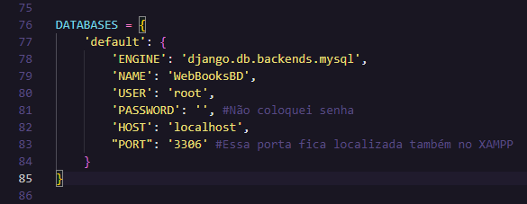

# Tutorial de Desenvolvimento Web com Django

> 👨‍💻 # Este repositório abriga um abrangente tutorial sobre o desenvolvimento web usando o framework Django. Aprenda passo a passo a criar um aplicativo web, desde a configuração inicial até o deploy em um ambiente de produção.

## 📗 Fase 1: Configuração Inicial e Ambiente de Desenvolvimento

### **1.1.** *Instalação do Python e Pip.*

- 🔔 Certifique-se de que o Python e Pip estejam instalados no seu sistema. Você pode verificar isso executando o seguinte comando no seu terminal ou prompt de comando:

```bash
python --version
```

```bash
pip --version
```

> Caso contrário, você pode baixa-los em seus sites e seguirem as instruções de instalação em [Python](https://www.python.org/downloads/) e [Pip](https://pip.pypa.io/en/stable/installation/)
>> Pip (Python Package Installer) geralmente é incluído na instalação do Python mais recente.

### **1.2.** *Configuração de um ambiente virtual (Virtual Environment).*

> 🗃️ # Um ambiente virtual é uma prática recomendada para isolar as dependências do seu projeto. Isso garante que você possa ter várias versões do Django e de outras bibliotecas em diferentes projetos sem conflitos.

##### 1. Abra um terminal ou prompt de comando

##### 2. Navegue até o diretório onde deseja criar seu ambiente virtual.

##### 3. Execute o seguinte comando para criar o ambiente virtual (substitua `nome-do-ambiente` pelo nome que você deseja para o seu ambiente):

- 🖥️ No Windows:
```bash
python -m venv nome-do-ambiente
```

- 💻 No macOS e Linux:
```bash
python3 -m venv nome-do-ambiente
```
##### 4. Para ativar o ambiente virtual, utilize os seguintes comandos no terminal ou prompt de comando:

- 🖥️ No Windows:
```bash
nome-do-ambiente\Scripts\activate
```

- 💻 No macOS e Linux:
```bash
source nome-do-ambiente/bin/activate
```

Agora, você está dentro do ambiente virtual e pode instalar as dependências específicas do projeto, incluindo o Django, quando ativar a venv seu terminal ficará assim:


- 🔩 Lembrando que quando fechar o seu editor e abrir novamente, terá de ativar a venv (ambiente virtual) novamente seguindo a etapa 1.2.4

### **1.3.** *Instalação do Django usando o Pip.*

- 🔔 Dentro do ambiente virtual, você pode instalar o Django executando o seguinte comando no terminal ou prompt de comando:

```bash
pip install django
```

Isso instalará a versão mais recente do Django no seu ambiente virtual.

### **1.4.** *Inicialização de um novo projeto Django.*

- 🔔 Agora que o Django está instalado, você pode criar um novo projeto Django com o seguinte comando (substitua **nome-do-projeto** pelo nome que você deseja para o projeto):

- 📌 Recomendo que o nome seja **setup**, dessa forma fica mais fácil para diferenciar a pasta de setup onde serão guardadas as configurações do seu site, depois é só renomear o nome do projeto para **nome-do-projeto** que você desejar.

```bash
django-admin startproject nome-do-projeto
```

ou

```bash
django-admin startproject setup
```


> 👨‍👦 # Assim criará a estrutura inicial do seu projeto Django, incluindo arquivos e diretórios necessários, pode renomear o diretório "pai" do projeto sem alterar o diretório **setup** que estiver dentro dele, normalmente os 2 possuem o mesmo nome, por isso que haverá complicações na hora de navegar.


### **1.5.** *Inicialização de um novo app Django.*

- 🔔 Para criar um novo aplicativo dentro do projeto, execute o seguinte comando no terminal ou prompt de comando dentro do diretório (**nome-do-projeto**) onde é o seu projeto (substitua **nome-do-app** pelo nome do aplicativo):

```bash
cd nome-do-projeto
python manage.py startapp nome-do-app
```

Isso criará a estrutura de diretórios e arquivos para o seu novo aplicativo Django.


### **1.6.** *Executando o servidor com Runserver*
> 📌 # O servidor de desenvolvimento é uma ferramenta que permite que você teste e visualize seu aplicativo enquanto o desenvolve. Lembre-se de que o servidor de desenvolvimento é destinado apenas para uso durante o desenvolvimento e testes.

##### 1. Abra um terminal ou prompt de comando.

##### 2. Navegue até a pasta raiz do seu projeto Django, onde está localizado o arquivo `manage.py`. Use o comando `cd` para acessar a pasta (`WebBooks` é o nome da minha pasta Raiz/Pai do projeto). 


##### 3. Agora que você está na pasta do projeto e com o ambiente virtual ativado, você pode iniciar o servidor de desenvolvimento com o seguinte comando:

- 🖥️ No Windows:
```bash
python manage.py runserver
```

- 💻 No macOS e Linux:
```bash
python3 manage.py runserver
```
##### 4. Após executar o comando, o servidor de desenvolvimento começará a ser executado. Você verá mensagens no terminal indicando que o servidor está "exibindo" em um endereço, normalmente em http://127.0.0.1:8000/, é só clicar por cima e entrar no link e você conseguirá observar a página inicial do seu projeto:


##### 5. Para desligar o Runserver, é só pressionar `Crtl + C` no terminal ou prompt de comando.

---------------------------------------------------------------

## 📗 Fase 2: Estrutura de Diretórios e Primeiras Configurações

### **2.1.** *Estrutura de Diretórios do Projeto*

> 🗂️ # Um projeto Django possui uma estrutura de diretórios organizada. Vamos dar uma olhada nos diretórios e arquivos principais, usaremos os meus exemplos como referência:

- `WebBooks/`: Este é o diretório raiz do seu projeto, no seu caso será o **nome-do-projeto** que você escolheu, além de que pode ser possível renomea-lo sem problemas
- - `setup/`: O diretório interno com o mesmo nome contém as configurações do projeto, caso renomea-lo terá de reconfigurar todos os arquivos internos dele.
- - - `settings.py`: Arquivo de configurações do projeto.
- - - `urls.py`: Arquivo de configurações de URLs.
- - - `wsgi.py`: Arquivo de configuração do servidor WSGI (usado para implantação em produção).
- - `Website/`: O diretório do seu aplicativo.
- - - `__init__.py`: Um arquivo Python vazio que informa ao Python que o diretório deve ser tratado como um pacote.
- - - `admin.py`:  Este arquivo é usado para configurar a administração do aplicativo, permitindo que você gerencie os modelos de dados por meio da interface de administração.
- - - `apps.py`: Arquivo de configuração do aplicativo, onde você pode definir metadados do aplicativo.
- - - `models.py`: Neste arquivo, você define os modelos de dados do aplicativo, que representam as tabelas do banco de dados.
- - - `tests.py`: Este é o local para escrever testes de unidade para o aplicativo.
- - - `views.py`: Neste arquivo, você define as visualizações que controlam a lógica de exibição do aplicativo.
- - - `migrations/`: Este diretório é criado quando você executa migrações e contém os arquivos de migração do aplicativo.
- - - `templates/`: Aqui, você pode criar diretórios e arquivos de modelos HTML usados para renderizar as páginas do aplicativo.
- - - `static/`: Diretório onde você pode armazenar arquivos estáticos, como folhas de estilo CSS, scripts JavaScript e imagens.
- - `manage.py`: Um utilitário de linha de comando para gerenciar seu projeto.

**🔩 - Algumas dessas estruturas iremos criar ao longo do tutorial**

### **2.2.** *Configuração do Banco de Dados*

>🔔 # Nesse tutorial iremos utilizar uma das formas de configurar o banco de dados, que é a utilização do XAMPP, Workbench MySQL e MySQL

##### 1. Instale o XAMPP, MySQL:

- Faça o download e instale o [XAMPP](https://www.apachefriends.org/pt_br/index.html)
- Faça o download e instale o [MySQLclient](https://dev.mysql.com/downloads/installer/) (Marque a opção MySQL Client na hora da instalação)
- Faça o download e instale o [MySQL Workbench](https://dev.mysql.com/downloads/workbench/) (É possível instalar o Workbench apenas com a instalação da etapa acima)

##### 2. Ligando o XAMPP (Apache e MySQL):

- Inicie o XAMPP Control Panel e certifique-se de que o servidor Apache e o servidor MySQL estejam em execução.


### **2.3.** *Configuração do Banco de Dados no MySQL Workbench*

- Abra o MySQL Workbench e clica no "+" para criar seu servidor.


- Crie um novo servidor MySQL se ainda não tiver um configurado e coloque o nome da "**Connection Name**", se quiser pode colocar uma senha em "**Password**" e clica em "**Ok**"


- Anote o nome do banco de dados, o nome de usuário (USERNAME) e a senha (PASSWORD) que você configurou no MySQL Workbench.

- Crie um novo esquema "**schema**" de banco de dados (database) para o seu projeto Django (por exemplo, **'WebBooksBD'**).


> É importante que o "**Charset/Collation**" sejam **utf8** e **utf8_unicode_ci** como na imagem, e depois dê **Apply**:


>> Depois de concordar tudo e finalizar as confirmações, seu banco será criado:


### **2.4.** *Configuração do Banco de Dados no Django*

- Abra o arquivo de configuração do banco de dados no seu projeto Django, que normalmente está localizado em `setup/settings.py`.

- Na seção **INSTALLED_APPS**, você vai inserir o nome do seu app entre os que já foram inseridos, colocando o **'nome-do-app',** dentro da seção como no exemplo:


> Caso queira confirmar qual é o nome do seu app, é só entrar no seu app e no arquivo `apps.py`, lá você encontrará esse "**name**", é só copiar e colar.


- Na seção **DATABASES**, você pode configurar a conexão com o MySQL Workbench. Substitua as configurações existentes pelas seguintes:

```bash
DATABASES = {
    'default': {
        'ENGINE': 'django.db.backends.mysql',
        'NAME': 'WebBooksBD',  # Nome do banco de dados que você criou no MySQL Workbench.
        'USER': 'seu_usuario_mysql',  # Nome de usuário do MySQL.
        'PASSWORD': 'sua_senha_mysql',  # Senha do MySQL.
        'HOST': 'localhost',  # Endereço do servidor do MySQL (normalmente 'localhost').
        'PORT': '3306',  # Porta do MySQL (normalmente '3306').
    }
}
```
> Certifique-se de substituir 'seu_usuario_mysql' e 'sua_senha_mysql' pelas credenciais reais do MySQL que você configurou no MySQL Workbench como as do meu:



### **2.5.** *Instalação de Pacotes Python para MySQL no Django*
> 🌎 # Aqui iremos instalar os pacotes necessários para o funcionamento do Banco de Dados com Django, vamos instalar os pacotes necessários na Venv
>
> 🚀 # A não ser que você deseja baixar todos esses pacotes e recursos de forma global fora da Venv, você pode sair da venv toda vez que for iniciar o Runserver.
>> **Sair da Venv**: 
>> - Você pode estar fechando e abrindo o editor de codigo que você estiver utilizando, dessa forma a venv fechará também
>> - Caso dessa forma não dê certo, podemos utilizar esses comandos no terminal ou prompt de comando antes de fechar e abrir o editor.
>> 
>> 🖥️ No Windows:
>> ```bash
>> nome-do-ambiente\Scripts\deactivate
>> ```
>> 
>> 💻 No macOS e Linux:
>> ```bash
>> deactivate
>> ```
>
> **Pacotes Necessários**:
> - Para que o Django possa se comunicar com o banco de dados MySQL, você precisa instalar pacotes Python que oferecem suporte ao MySQL. Existem duas opções comuns: `mysql-connector-python` e `mysqlclient`.
>
> ```bash
> pip install mysql-connector-python
> ```
> ```bash
> pip install mysqlclient
> ```
>
> **Exemplo sem a Venv:**


> 🛡️ - Depois ative novamente a Venv que você desativou usando os comandos que já foram ensinados para dar continuidade as configurações do seu projeto.

---------------------------------------------------------------

## 📗 Fase 3: Models e Banco de Dados

> 🔔 # Nesta fase, você criará modelos para representar dados em seu aplicativo Django e entenderá como o Django ORM (Object-Relational Mapping) funciona para mapear esses modelos para tabelas no banco de dados.

### **3.1.** *Criar Modelos*

- Modelos são classes que definem a estrutura dos dados que você deseja armazenar em seu banco de dados. Vamos criar um modelo simples como exemplo. Suponha que você esteja criando um aplicativo de gerenciamento de livros. Aqui está um exemplo de modelo de livro:

##### 1. Abra o arquivo `models.py` no diretório do seu aplicativo (por exemplo, `Website/models.py`).


##### 2. Crie uma classe para o modelo de livro:
```bash
from django.db import models

class Livro(models.Model):
    titulo = models.CharField(max_length=200)
    autor = models.CharField(max_length=100)
    publicação = models.DateField()
    paginas = models.IntegerField()
```
> 🔔 - Neste exemplo, criamos um modelo de livro com campos como título, autor, data de publicação e número de páginas. Você pode personalizar os campos de acordo com suas necessidades.

### **3.2.** *Migrações e Aplicação*

- Agora que você criou o modelo, é hora de criar uma migração para aplicá-lo ao banco de dados.

##### 1. No terminal, dentro do diretório raiz/pai do projeto, execute o seguinte comando para criar uma migração:
```bash
python manage.py makemigrations
```
##### 2. Em seguida, execute o comando para aplicar a migração:
```bash
python manage.py migrate
```


### **3.3.** *Django Admin*

- O Django oferece um painel de administração prontamente disponível para gerenciar os dados do banco de dados. Vamos habilitá-lo.

##### 1. Abra o arquivo `admin.py` no diretório do seu aplicativo (por exemplo, `Website/admin.py`).


##### 2. Registre o modelo de livro no painel de administração:
```bash
from django.contrib import admin
from .models import Livro

admin.site.register(Livro)
```

> - **from .models import Livro:** Retira de dentro do arquivo `models.py` a class chamada `Livro`.
> - **admin.site.register(Livro):** Indica que no painel de Administrador do Django será possível registrar dados na tabela chamada `Livro`.

### **3.4.** *Criar Superusuário*

- Para acessar o painel de administração, você precisará criar um superusuário.

- No terminal, dentro do diretório do projeto, execute o seguinte comando e siga as instruções para criar um superusuário, e depois preencha os parâmetros com nome e senha que você não esquecerá, se preferir pode usar como no exemplo:


> 🔩 - O Password é invisível por questões de segurança, o Email pode ser aleatório ou o seu oficial, as informações colocadas no exemplo são:
> - Username: admin
> - Email: admin@admin.com
> - Password: 1234
> - Password (again): 1234
> - Confirmação se vou usar senha fraca: y

- Agora quando você fazer o comando do **Runserver** que já foi ensinado na etapa **1.6.4**, vá na URL do seu navegador e adiciona `/admin` e faça o login da sua conta que você criou aqui no Django.


> 🎛️ # Nesse painel você consegue ter acesso para inserir informações, remover, editar e ler dados inseridos no seu banco de dados, esse ambiente não é recomendável que seja acessado por qualquer usuário, até mesmo para funcionários, é um ambiente de trabalho apenas do ADM do Banco de Dados ou usuários com privilégios elevados.
---------------------------------------------------------------

## 📗 Fase 4: Views e URLs

### **4.1.** *Criar Views*

- Views são funções ou classes que processam solicitações do navegador e retornam respostas. Vamos criar uma view simples que exibe uma lista de livros.

##### 1. Abra o arquivo `views.py` no diretório do seu aplicativo (por exemplo, `Website/views.py`).


##### 2. Crie uma view:
```bash
from django.shortcuts import render
from .models import Livro

def lista_livros(request):
    livros = Livro.objects.all()
    return render(request, 'lista_livros.html', {'livros': livros})
```

> Nesta view, estamos obtendo todos os objetos de livro do banco de dados e passando-os para um template chamado *lista_livros.html*.
> - **livros = Livro.objects.all():** Pega todos os `objects` de models chamado `Livro` e passa-os para dentro da variável `livros`.
> - **render(request, 'lista_livros.html'):** Ele renderizará usando o `request`, o template (site) chamado `lista_livros.html` de dentro da pasta `templates` *(OBS: vamos criar a pasta ainda)*.
> - **{'livros' : livros}:** Ele criará um dicionário chamado `livros` e pegará a variável `livros` e receber todas as informações guardadas dentro da variável.

### **4.2.** *Definir URLs*

> 🔔 # As URLs mapeiam solicitações para views. Vamos definir uma URL que chama a view `lista_livros`.

##### 1. Crie um arquivo chamado `urls.py` no diretório do seu aplicativo (por exemplo, `Website/urls.py`).


##### 2. Defina a URL dentro do arquivo `urls.py` no diretório do seu aplicativo:

```bash
from django.urls import path
from . import views

urlpatterns = [
    path('livros/', views.lista_livros, name='lista_livros'),
]
```

> Agora, quando os usuários acessarem `/livros/` em seu site, a view *lista_livros* será chamada.
> - **from . import views:** Importa da pasta atual (Website) tudo do arquivo views.py (Class, Funções, Métodos, etc.)
> - **path('livros/', views.lista_livros, name='lista_livros'):** Para acessar a `views.lista_livros` é necessário que o usuário esteja na página da URL `livros/`, o nome dessa path é nomeada de `lista_livros`
> 📌 *OBS:* A colocação de "," dentro do `urlpatterns` permite que possa ser criada várias `path` de uma vez, então é possível a criação de várias views e URLs para essas views em seu aplicativo.

### **4.3.** *Configurando URLs de Setup*

> 🔔 # Para que o setup do seu projeto reconheça que as configurações feitas nas URLs de dentro do seu aplicativo (Website) são oficiais, é necessário interligar uma ponte de acesso entre eles utilizando o `include`

- Navegue até o setup do seu diretório Raiz/Pai, procure pelo arquivo chamado `urls.py` e faça as devidas interligações:

```bash
from django.contrib import admin
from django.urls import path, include

urlpatterns = [
    path('admin/', admin.site.urls),
    path('', include('Website.urls'))

]
```
- Como no exemplo:


> - **path('', include('Website.urls')):** Ele faz um path dizendo que naturalmente todas as urls do aplicativo chamado `Website` localizados dentro do arquivo `urls` sejam acrescentadas/incluidas.

### **4.4.** *Criar um Template*

> 🔔 # Um template é um arquivo HTML que define como os dados são apresentados. Vamos criar um template para exibir a lista de livros.

##### 1. Crie uma pasta chamada `templates` no diretório do seu aplicativo (por exemplo, `Website/templates`).


##### 2. Dentro da pasta templates, crie um arquivo chamado `lista_livros.html` (por exemplo, `Website/templates/lista_livros.html`)


##### 3. No arquivo `lista_livros.html`, você pode usar os dados passados pela view para criar a página da web.

```bash
<!DOCTYPE html>
<html>
<head>
    <title>Lista de Livros</title>
</head>
<body>
    <h1>Lista de Livros</h1>
    <ul>
        
        <li>{{ livro.título }} por {{ livro.autor }}</li>
        
    </ul>
</body>
</html>
```

##### 4. Testar a View

- Agora, você pode iniciar o servidor de desenvolvimento do Django e testar sua view, utilize runserver para testar o seu site como foi ensinado no **1.6.4**

- Lembre-se de ativar a sua Venv que foi ensinado no **1.4.2**

🚫 ***ERROR - Caso você não ative:***


- Lembre-se de deixar o seu Banco de Dados MySQL ligado (XAMPP) como foi ensinado no **2.2.2**

🚫 ***ERROR - Caso você não ligue:***


- Lembre-se de digitar a URL corretamente como ensinado no **3.4**

🚫 ***ERROR - Caso você não digite:***


> 🗂️ - *OBS:* A página descreve quais URLs estão disponíveis

- Depois de tudo estiver em ordem, você poderá acessar a página com o Link que aparecerá quando você realizar o comando de Runserver.


- Os livros não foram adicionados ainda pelo **FOR** no HTML, pois não há nenhum livro registrado no seu banco.

##### EXTRA. Tornar a página como principal (index), sem a necessidade de digitar `livros/` toda hora, para que ela possa aparecer sem essa necessidade.

> 🎛️ # Para tornar uma das páginas do seu app como principal (index), é necessário que você reconfigure a URL dessa página, é bem simples:


- Dessa forma o site assim que iniciar o servidor, irá te levar até a página diretamente sem a digitação na url.


